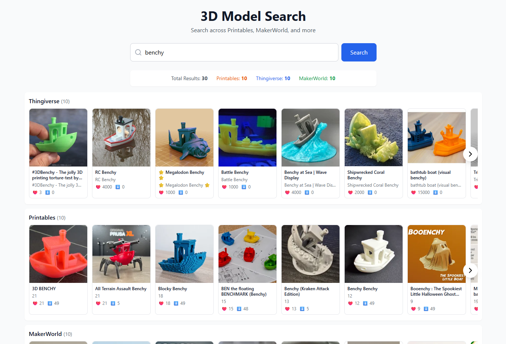

# 3D Model Search

A unified search engine for 3D printable models across multiple platforms. Search Thingiverse, Printables, and MakerWorld simultaneously and view results in one place.



## Features

- 🔍 **Multi-Platform Search** - Search across Thingiverse, Printables, and MakerWorld at once
- ⚡ **Smart Caching** - Results are cached locally for instant repeat searches
- 🎯 **Clean Interface** - Organized results by platform with horizontal scrolling
- 🖼️ **Rich Previews** - View thumbnails, titles, authors, and stats (likes/downloads)
- 🚀 **Self-Hosted** - Run entirely on your local machine, no API keys needed

## How It Works

The application uses Puppeteer to scrape search results from each platform's website. Results are cached in a local SQLite database for 7 days, making repeated searches instant and reducing load on the scraped sites.

## Prerequisites

- [Node.js](https://nodejs.org/) (v20.18 or higher)
- [npm](https://www.npmjs.com/) (comes with Node.js)

## Installation

1. **Clone the repository**
   ```bash
   git clone https://github.com/irose000/3D-Printer-Model-Multi-Search.git
   cd 3D-Printer-Model-Multi-Search
   ```

2. **Install backend dependencies**
   ```bash
   npm install
   ```

3. **Install frontend dependencies**
   ```bash
   cd client
   npm install
   cd ..
   ```

## Running the Application

You need to run both the backend server and frontend development server:

### Start the Backend (Terminal 1)

```bash
node server.js
```

The backend API will start on `http://localhost:3001`

You should see:
```
3D Model Search API running on http://localhost:3001

Configuration:
- Thingiverse: ✓ Puppeteer scraping
- Printables: ✓ Puppeteer scraping
- MakerWorld: ✓ Puppeteer scraping

Initializing browser...
Browser launched successfully
Ready to accept requests!
```

### Start the Frontend (Terminal 2)

```bash
cd client
npm run dev
```

The frontend will start on `http://localhost:5173`

Open your browser and navigate to `http://localhost:5173`

## Usage

1. Enter a search term (e.g., "filament guide", "phone holder", "cable organizer")
2. Click **Search** or press Enter
3. Wait 5-10 seconds for results (first search only - cached searches are instant!)
4. Results are grouped by platform with horizontal scrolling
5. Click any card to open the model page on the original site

## Project Structure

```
3d-model-search/
├── server.js              # Backend API server (Puppeteer scrapers)
├── package.json           # Backend dependencies
├── search_cache.db        # SQLite cache (auto-created)
├── client/                # Frontend React application
│   ├── src/
│   │   ├── App.jsx       # Main React component
│   │   ├── index.css     # Styles
│   │   └── main.jsx      # Entry point
│   ├── package.json      # Frontend dependencies
│   └── vite.config.js    # Vite configuration
└── README.md             # This file
```

## Technologies Used

### Backend
- **Node.js** - JavaScript runtime
- **Express** - Web server framework
- **Puppeteer** - Headless browser for web scraping
- **better-sqlite3** - Local database for caching
- **node-cache** - In-memory caching layer

### Frontend
- **React** - UI framework
- **Vite** - Build tool and dev server
- **Tailwind CSS** - Styling
- **Lucide React** - Icons

## Configuration

### Viewing Browser Activity

To see the browser while it scrapes (useful for debugging), edit `server.js`:

```javascript
browser = await puppeteer.launch({
  headless: false,  // Change 'new' to false
  args: [...]
});
```

### Cache Duration

Search results are cached for 7 days. To change this, edit `server.js`:

```javascript
const cleanOldSearchesStmt = db.prepare(`DELETE FROM searches WHERE updated_at < datetime('now', '-7 days')`);
// Change '-7 days' to your preferred duration
```

## Troubleshooting

### Search is slow (8+ seconds)
This is normal for the first search. Puppeteer needs to load each platform's page and extract results. Subsequent searches for the same term are instant thanks to caching.

### "Failed to fetch" error
Make sure the backend server is running on port 3001. Check Terminal 1 for any error messages.

### No results from a specific platform
Some sites have anti-bot protection that may occasionally block requests. The scraper will continue with other platforms. Try again in a few minutes.

### Port already in use
If port 3001 or 5173 is already in use, you can change them:
- Backend: Edit `PORT` in `server.js`
- Frontend: Vite will auto-increment to 5174, 5175, etc.

## Limitations

- **Speed**: First search takes 5-10 seconds as it scrapes all three sites
- **No API**: Uses web scraping, so changes to site layouts may break scrapers
- **Rate Limiting**: Excessive searches may trigger anti-bot measures
- **No Authentication**: Cannot access private models or user-specific content

## Contributing

Contributions are welcome! If a scraper breaks due to site changes, please open an issue or submit a pull request.

## Legal & Ethical Considerations

This tool is for personal use only. Please:
- Respect the Terms of Service of Thingiverse, Printables, and MakerWorld
- Use reasonable rate limiting (the built-in caching helps with this)
- Do not use this for commercial purposes or high-volume scraping
- Always visit the original site to download files and credit creators

## License

MIT License - See LICENSE file for details

## Acknowledgments

- [Thingiverse](https://www.thingiverse.com/) - MakerBot's 3D model repository
- [Printables](https://www.printables.com/) - Prusa's 3D model repository  
- [MakerWorld](https://makerworld.com/) - Bambu Lab's 3D model repository

---

**Note**: This project is not affiliated with or endorsed by MakerBot, Prusa, Bambu Lab, or any of the platforms it searches.
